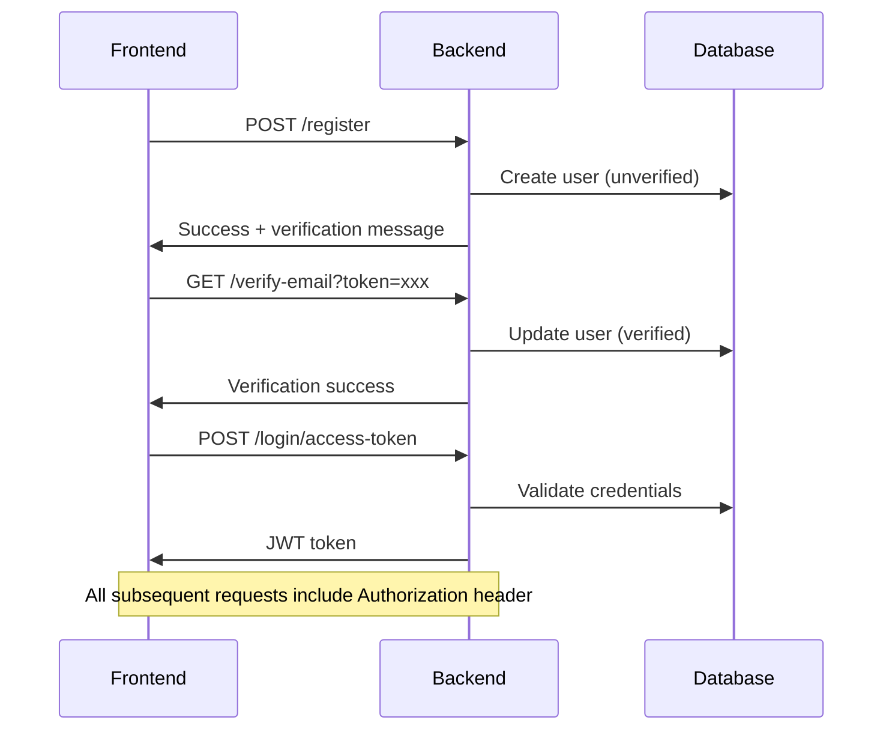

# Backend API Documentation

## Overview

This document provides comprehensive API documentation for the backend service, including authentication, user management, and role-based access control. The API is built with FastAPI and uses PostgreSQL for data persistence.

## Base URL

```
http://localhost:8000/api/v1
```

## Authentication

The API uses JWT (JSON Web Tokens) for authentication. All protected endpoints require a Bearer token in the Authorization header.

### Token Format
```
Authorization: Bearer <your_jwt_token>
```

## User Roles & Permissions

| Role | Description | Permissions |
|------|-------------|-------------|
| `user` | Standard user | `["document:read"]` |
| `admin1` | First-level admin | TBD |
| `admin2` | Superuser | Full access |

## API Endpoints

### 1. User Registration

**Endpoint:** `POST /register`

**Description:** Create a new user account with email verification

**Request Body:**
```json
{
  "email": "user@troy.edu",
  "password": "securepassword123",
  "name": "John Doe",
  "major": "Computer Science",
  "class_": "Senior",
  "role": "user"
}
```

**Response (201):**
```json
{
  "message": "Registration successful. Please check your @troy.edu email to verify your account."
}
```

**Validation Rules:**
- Email must end with `@troy.edu`
- Password must be at least 8 characters
- `id_troy` is auto-generated as a unique 6-digit number
- `role` defaults to "user" if not specified

**Error Responses:**
- `400`: Email already exists
- `400`: Invalid email domain (must be @troy.edu)

### 2. Email Verification

**Endpoint:** `GET /verify-email`

**Description:** Verify user email with token from verification email

**Query Parameters:**
- `token`: JWT verification token

**Response (200):**
```json
{
  "message": "Email verified successfully. You can now log in."
}
```

**Error Responses:**
- `400`: Invalid or expired token
- `400`: Email already verified
- `404`: User not found

### 3. User Login

**Endpoint:** `POST /login/access-token`

**Description:** Authenticate user and receive access token

**Request Body (form-encoded):**
```
username=user@troy.edu&password=securepassword123
```

**Response (200):**
```json
{
  "access_token": "eyJhbGciOiJIUzI1NiIsInR5cCI6IkpXVCJ9...",
  "token_type": "bearer"
}
```

**Token Payload Structure:**
```json
{
  "sub": "user@troy.edu",
  "role": "user",
  "permissions": ["document:read"],
  "exp": 1754817235
}
```

**Error Responses:**
- `400`: Incorrect email or password
- `400`: Inactive user
- `401`: Account not verified

### 4. Health Check

**Endpoint:** `GET /utils/health-check`

**Description:** Check API health status

**Response (200):**
```json
true
```

### 5. Test Email (Admin Only)

**Endpoint:** `POST /utils/test-email`

**Description:** Send test email (requires admin2 role)

**Headers:**
```
Authorization: Bearer <admin_token>
```

**Query Parameters:**
- `email_to`: Recipient email address

**Response (201):**
```json
{
  "message": "Test email sent"
}
```

**Error Responses:**
- `401`: Not authenticated
- `403`: Insufficient privileges

### 6. User Count (Admin Only)

**Endpoint:** `GET /private/users-count`

**Description:** Get total number of users (requires admin2 role)

**Headers:**
```
Authorization: Bearer <admin_token>
```

**Response (200):**
```json
42
```

**Error Responses:**
- `401`: Not authenticated
- `403`: Insufficient privileges

### 7. Get User by ID (Admin Only)

**Endpoint:** `GET /private/user/{user_id}`

**Description:** Get specific user details by UUID (requires admin2 role)

**Headers:**
```
Authorization: Bearer <admin_token>
```

**Response (200):**
```json
{
  "id": "10496134-6e65-4eee-a81f-e5bce1a37b86",
  "id_troy": "123456",
  "name": "John Doe",
  "email": "user@troy.edu",
  "major": "Computer Science",
  "class_": "Senior",
  "role": "user",
  "permissions": ["document:read"],
  "is_active": true,
  "is_verified": true
}
```

**Error Responses:**
- `401`: Not authenticated
- `403`: Insufficient privileges
- `404`: User not found

## Data Models

### User Model

```typescript
interface User {
  id: string;           // UUID
  id_troy: string;      // Unique 6-digit Troy ID
  name: string;         // User's full name
  email: string;        // Email (must be @troy.edu)
  major?: string;       // Optional major
  class_?: string;      // Optional class year
  role: string;         // "user" | "admin1" | "admin2"
  permissions: string[]; // Array of permission strings
  is_active: boolean;   // Account status
  is_verified: boolean; // Email verification status
}
```

### User Creation Schema

```typescript
interface UserCreate {
  email: string;        // Required, must be @troy.edu
  password: string;     // Required, min 8 chars
  name: string;         // Required
  major?: string;       // Optional
  class_?: string;      // Optional
  role?: string;        // Optional, defaults to "user"
}
```

## Authentication Flow



## Error Handling

### Standard Error Response Format

```json
{
  "detail": "Error message description"
}
```

### Common HTTP Status Codes

| Code | Description | Usage |
|------|-------------|-------|
| `200` | Success | GET requests, successful operations |
| `201` | Created | POST requests (user registration, email sending) |
| `400` | Bad Request | Validation errors, duplicate emails |
| `401` | Unauthorized | Missing or invalid authentication |
| `403` | Forbidden | Insufficient privileges |
| `404` | Not Found | Resource doesn't exist |
| `422` | Validation Error | Invalid request body/parameters |
| `500` | Internal Server Error | Server-side errors |

## Security Considerations

### JWT Token Security
- Tokens expire after 8 days (configurable)
- Tokens include user role and permissions
- Store tokens securely in frontend (httpOnly cookies recommended)

### Password Security
- Passwords are hashed using bcrypt
- Minimum 8 characters recommended
- Never send passwords in responses

### Email Verification
- Required before login
- Tokens expire after 48 hours
- Only @troy.edu emails allowed

## Environment Variables

The backend requires these environment variables:

```bash
# Required
PROJECT_NAME=FastAPI Project
FIRST_SUPERUSER=admin@example.com
FIRST_SUPERUSER_PASSWORD=changethis
POSTGRES_SERVER=localhost
POSTGRES_PORT=5432
POSTGRES_USER=postgres
POSTGRES_PASSWORD=your_password
POSTGRES_DB=your_app_dev

# Optional (for email functionality)
SMTP_HOST=
SMTP_USER=
SMTP_PASSWORD=
EMAILS_FROM_EMAIL=info@example.com

# Security
SECRET_KEY=changethis  # Change in production
ENVIRONMENT=local
```

## CORS Configuration

The API is configured to accept requests from:
- `http://localhost:5173` (Vite dev server)
- `http://localhost:3000` (React dev server)
- `http://localhost:8080` (Alternative dev server)

## Rate Limiting

Currently no rate limiting implemented. Consider implementing for production.

## Testing Endpoints

### Quick Test Commands

```bash
# Health check
curl http://localhost:8000/api/v1/utils/health-check

# Register user
curl -X POST http://localhost:8000/api/v1/register \
  -H "Content-Type: application/json" \
  -d '{"email": "test@troy.edu", "password": "password123", "name": "Test User"}'

# Login
curl -X POST http://localhost:8000/api/v1/login/access-token \
  -H "Content-Type: application/x-www-form-urlencoded" \
  -d "username=test@troy.edu&password=password123"
```

## Recent Fixes Applied

1. **Fixed `EMAILS_ENABLED` attribute error** - Changed to `emails_enabled` in settings
2. **Added missing `SERVER_HOST` property** - Added to Settings class
3. **Fixed database unique constraint violation** - Auto-generate unique `id_troy` values
4. **Updated bcrypt version compatibility** - Resolved passlib warnings
5. **Installed missing dependencies** - Added `python-jose[cryptography]`

## API Documentation

Interactive API documentation is available at:
- Swagger UI: `http://localhost:8000/docs`
- OpenAPI Schema: `http://localhost:8000/api/v1/openapi.json`

## Deployment Notes

- Database migrations run automatically on startup
- Email functionality requires SMTP configuration
- JWT tokens use HS256 algorithm
- All endpoints return JSON responses
- CORS is enabled for development

---

*This documentation is maintained by the backend team. For questions or updates, please contact the backend engineering team.*